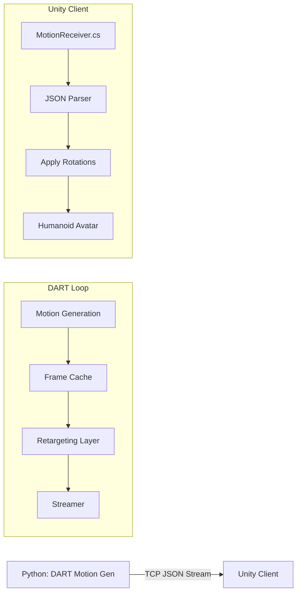

# DART to Unity Real-Time Streaming

This guide explains how to stream generated motion from DART to a Unity Humanoid Avatar in real-time.

## Architecture



## Data Flow
1.  **Generation**: DART generates motion (SMPL format).
2.  **Caching**: Root position, Root rotation, and Joint rotations are cached per frame.
3.  **Retargeting**:
    *   Coordinate System: Converted from Right-Handed (PyTorch3D) to Left-Handed (Unity).
    *   Format: Rotation Matrices converted to Quaternions.
    *   Mapping: SMPL joints mapped to Unity Humanoid Bone names.
4.  **Streaming**: JSON packets sent over TCP.
5.  **Reception**: Unity script parses JSON and applies `localRotation` to the avatar's Animator bones.

## Setup Instructions

### 1. Python Side
Run the demo with streaming enabled:
```bash
python -m mld.rollout_demo --denoiser_checkpoint <path_to_ckpt> --enable_streaming 1
```
Or use the provided script modification in `demos/run_demo.sh` (you may need to add `--enable_streaming 1` to the command line args there).

The server starts on `0.0.0.0:8080` by default (broadcasting to all interfaces).

### 2. Unity Side

1.  Create a fresh Unity 3D project.
2.  Import a humanoid character.
3.  Copy the `MotionReceiver.cs` file from the root of this repository into your Unity project's `Assets` folder.
4.  Create an empty GameObject in your scene (or select any object).
5.  Attach the `MotionReceiver` script to it.
6.  **Important**: In the Inspector, drag your Character (the GameObject with the Animator) into the `Target Animator` field of the `MotionReceiver` component.
7.  (Optional) Check **Debug Mode** to see console logs of received data.
8.  Press Play in Unity.

### Unity C# Script

*The script is now provided as `MotionReceiver.cs` in the root of the repo.*

## Recording and Playback

Two additional scripts are provided for recording and playing back animation data:

### Recording
1.  Copy `MotionRecorder.cs` to your Unity project.
2.  Add a `MotionRecorder` component to any GameObject.
3.  In the `MotionReceiver` Inspector, assign the `MotionRecorder` to the **Recorder** field.
4.  Use the `isRecording` checkbox or call `StartRecording()` / `StopRecording()` to control recording.
5.  Recordings are saved to `Application.persistentDataPath/Recordings/` as JSON files.

### Playback
1.  Copy `MotionPlayer.cs` to your Unity project.
2.  Add a `MotionPlayer` component to a GameObject.
3.  Assign your character's Animator to **Target Animator**.
4.  Set the **Recording File Path** to your saved recording.
5.  Call `LoadRecording()` then `Play()` to play back the animation.

## Troubleshooting
*   **Twisted Limbs**: Check the Coordinate System conversion in `utils/unity_streamer.py`. If limbs are twisted, try swapping the quaternion components (e.g., negate x or w).
*   **Latency**: The Unity script currently drains the buffer to play the latest frame. If it's too jittery, implement a jitter buffer (interpolate between frames).
